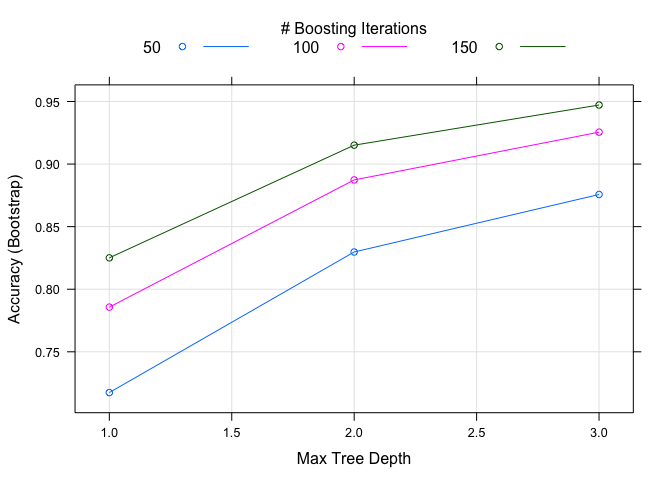

# Machine Learning Assigment
Pablo Rojo  
24 de agosto de 2014  

#Introduction
In this project, your goal will be to use data from accelerometers on the belt, forearm, arm, and dumbell of 6 participants. They were asked to perform barbell lifts correctly and incorrectly in 5 different ways. More information is available from the website here: [http://groupware.les.inf.puc-rio.br/har](http://groupware.les.inf.puc-rio.br/har) (see the section on the Weight Lifting Exercise Dataset). 

#Data Exploration and Cleaning
First we load the data provided for training:

```r
data <- read.csv("pml-training.csv")
```

Since cross validation will be used, the data is split in training and testing sets:

```r
library(caret)
```

```
## Loading required package: lattice
## Loading required package: ggplot2
```

```r
set.seed(2235)
inTrain <- createDataPartition( y=data$classe,
                                p=0.75, list=FALSE)
training <- data[inTrain,]
testing <- data[-inTrain,]
```

A first look at the data using:


```r
summary(training)
```

show:

- 160 variables
- Multiple columns have mostly NA.
- The first 7 variables are not numeric.

##Select Predictors
First, non numeric variables need to be removed:

```r
nonPredictor <- 1:7
fTraining <- training[, -nonPredictor]
fTesting  <- testing[, -nonPredictor]
```

##Remove Columns with NA
Columns with NA are also eliminated:


```r
isNAColumn <- apply( fTraining , 2 , function(x) any(is.na(x)) )

fTraining <- fTraining[, !isNAColumn]
fTesting  <- fTesting[, !isNAColumn]
```

##Near Zero Variables
In order to improve the model, near zero variables are deleted from the data set as well:


```r
nzv <- nearZeroVar(fTraining)
fTraining <- fTraining[, -nzv]
fTesting <- fTesting[, -nzv]
```

##Identifying Correlated Predictors
Finally, highly correlated variables are also removed:


```r
highlyCor <- findCorrelation(cor(fTraining[,-ncol(fTraining)]), cutoff = 0.75)
fTraining <- fTraining[, -highlyCor]
fTesting <- fTesting[, -highlyCor]
```

##Final Training set
The resulting data set has now 41 variables:


```r
summary(fTraining)
```

```
##     yaw_belt       gyros_belt_x      gyros_belt_y      gyros_belt_z  
##  Min.   :-180.0   Min.   :-1.0400   Min.   :-0.6400   Min.   :-1.46  
##  1st Qu.: -88.3   1st Qu.:-0.0300   1st Qu.: 0.0000   1st Qu.:-0.20  
##  Median : -11.8   Median : 0.0300   Median : 0.0200   Median :-0.10  
##  Mean   : -10.5   Mean   :-0.0047   Mean   : 0.0401   Mean   :-0.13  
##  3rd Qu.:  14.2   3rd Qu.: 0.1100   3rd Qu.: 0.1100   3rd Qu.:-0.02  
##  Max.   : 179.0   Max.   : 2.2200   Max.   : 0.5600   Max.   : 1.62  
##  magnet_belt_x   magnet_belt_z     roll_arm        pitch_arm     
##  Min.   :-52.0   Min.   :-623   Min.   :-180.0   Min.   :-88.80  
##  1st Qu.:  9.0   1st Qu.:-375   1st Qu.: -32.0   1st Qu.:-25.70  
##  Median : 35.0   Median :-319   Median :   0.0   Median :  0.00  
##  Mean   : 56.1   Mean   :-345   Mean   :  17.7   Mean   : -4.49  
##  3rd Qu.: 60.0   3rd Qu.:-306   3rd Qu.:  77.0   3rd Qu.: 11.60  
##  Max.   :485.0   Max.   : 293   Max.   : 180.0   Max.   : 88.50  
##     yaw_arm        total_accel_arm  gyros_arm_x      gyros_arm_z    
##  Min.   :-180.00   Min.   : 1.0    Min.   :-6.370   Min.   :-2.330  
##  1st Qu.: -43.20   1st Qu.:17.0    1st Qu.:-1.330   1st Qu.:-0.070  
##  Median :   0.00   Median :27.0    Median : 0.080   Median : 0.250  
##  Mean   :  -1.01   Mean   :25.5    Mean   : 0.039   Mean   : 0.275  
##  3rd Qu.:  45.30   3rd Qu.:33.0    3rd Qu.: 1.560   3rd Qu.: 0.720  
##  Max.   : 180.00   Max.   :66.0    Max.   : 4.870   Max.   : 3.020  
##   accel_arm_y      magnet_arm_x   magnet_arm_z  roll_dumbbell   
##  Min.   :-318.0   Min.   :-580   Min.   :-597   Min.   :-153.5  
##  1st Qu.: -54.0   1st Qu.:-299   1st Qu.: 133   1st Qu.: -19.0  
##  Median :  12.0   Median : 292   Median : 444   Median :  48.4  
##  Mean   :  31.6   Mean   : 193   Mean   : 307   Mean   :  24.0  
##  3rd Qu.: 138.0   3rd Qu.: 637   3rd Qu.: 544   3rd Qu.:  67.8  
##  Max.   : 308.0   Max.   : 782   Max.   : 694   Max.   : 153.4  
##  pitch_dumbbell    yaw_dumbbell     total_accel_dumbbell gyros_dumbbell_y
##  Min.   :-148.5   Min.   :-150.87   Min.   : 0.0         Min.   :-2.10   
##  1st Qu.: -40.8   1st Qu.: -77.66   1st Qu.: 4.0         1st Qu.:-0.14   
##  Median : -21.2   Median :  -5.06   Median :11.0         Median : 0.03   
##  Mean   : -10.9   Mean   :   1.18   Mean   :13.8         Mean   : 0.04   
##  3rd Qu.:  17.1   3rd Qu.:  78.56   3rd Qu.:20.0         3rd Qu.: 0.21   
##  Max.   : 149.4   Max.   : 154.95   Max.   :58.0         Max.   :52.00   
##  gyros_dumbbell_z magnet_dumbbell_z  roll_forearm     pitch_forearm   
##  Min.   : -2.4    Min.   :-249      Min.   :-180.00   Min.   :-72.50  
##  1st Qu.: -0.3    1st Qu.: -45      1st Qu.:  -0.74   1st Qu.:  0.00  
##  Median : -0.1    Median :  13      Median :  20.20   Median :  9.07  
##  Mean   : -0.1    Mean   :  45      Mean   :  33.61   Mean   : 10.75  
##  3rd Qu.:  0.0    3rd Qu.:  94      3rd Qu.: 140.00   3rd Qu.: 28.40  
##  Max.   :317.0    Max.   : 452      Max.   : 180.00   Max.   : 87.90  
##   yaw_forearm     total_accel_forearm gyros_forearm_x   accel_forearm_x 
##  Min.   :-180.0   Min.   :  0.0       Min.   :-22.000   Min.   :-498.0  
##  1st Qu.: -69.4   1st Qu.: 29.0       1st Qu.: -0.210   1st Qu.:-179.0  
##  Median :   0.0   Median : 36.0       Median :  0.050   Median : -57.0  
##  Mean   :  18.4   Mean   : 34.8       Mean   :  0.163   Mean   : -62.2  
##  3rd Qu.: 109.0   3rd Qu.: 41.0       3rd Qu.:  0.580   3rd Qu.:  74.0  
##  Max.   : 180.0   Max.   :108.0       Max.   :  3.970   Max.   : 389.0  
##  accel_forearm_z  magnet_forearm_x magnet_forearm_y magnet_forearm_z
##  Min.   :-446.0   Min.   :-1280    Min.   :-896.0   Min.   :-966    
##  1st Qu.:-181.0   1st Qu.: -614    1st Qu.:  -0.8   1st Qu.: 202    
##  Median : -39.0   Median : -377    Median : 593.0   Median : 512    
##  Mean   : -55.9   Mean   : -312    Mean   : 380.3   Mean   : 397    
##  3rd Qu.:  26.0   3rd Qu.:  -74    3rd Qu.: 737.0   3rd Qu.: 654    
##  Max.   : 291.0   Max.   :  672    Max.   :1480.0   Max.   :1090    
##  classe  
##  A:4185  
##  B:2848  
##  C:2567  
##  D:2412  
##  E:2706  
## 
```

#Model Creation
This is a classification problem. Generalized Boosted Regression Model is proposed as a method: 


```r
modelFitGbm <- train( classe ~.,
                      data=fTraining,
                      method="gbm",
                      verbose=FALSE)
```
 

## In and Out sampling error
In order to analyse the error in the model, confusion matrices are generated for Training and Testing data set:


```r
confusionMatrix(fTraining$classe,predict(modelFitGbm,fTraining))
```

```
## Loading required package: gbm
## Loading required package: survival
## Loading required package: splines
## 
## Attaching package: 'survival'
## 
## The following object is masked from 'package:caret':
## 
##     cluster
## 
## Loading required package: parallel
## Loaded gbm 2.1
## Loading required package: plyr
```

```
## Confusion Matrix and Statistics
## 
##           Reference
## Prediction    A    B    C    D    E
##          A 4142   28    9    5    1
##          B   73 2697   67    6    5
##          C    0   97 2435   31    4
##          D    2    9   89 2296   16
##          E    4   15   24   36 2627
## 
## Overall Statistics
##                                         
##                Accuracy : 0.965         
##                  95% CI : (0.961, 0.968)
##     No Information Rate : 0.287         
##     P-Value [Acc > NIR] : < 2e-16       
##                                         
##                   Kappa : 0.955         
##  Mcnemar's Test P-Value : 1.22e-15      
## 
## Statistics by Class:
## 
##                      Class: A Class: B Class: C Class: D Class: E
## Sensitivity             0.981    0.948    0.928    0.967    0.990
## Specificity             0.996    0.987    0.989    0.991    0.993
## Pos Pred Value          0.990    0.947    0.949    0.952    0.971
## Neg Pred Value          0.992    0.987    0.984    0.994    0.998
## Prevalence              0.287    0.193    0.178    0.161    0.180
## Detection Rate          0.281    0.183    0.165    0.156    0.178
## Detection Prevalence    0.284    0.194    0.174    0.164    0.184
## Balanced Accuracy       0.989    0.967    0.959    0.979    0.992
```

```r
confusionMatrix(fTesting$classe,predict(modelFitGbm,fTesting))
```

```
## Confusion Matrix and Statistics
## 
##           Reference
## Prediction    A    B    C    D    E
##          A 1373   11    4    5    2
##          B   38  868   34    3    6
##          C    0   39  805    9    2
##          D    0    6   36  755    7
##          E    5    9    8   14  865
## 
## Overall Statistics
##                                         
##                Accuracy : 0.951         
##                  95% CI : (0.945, 0.957)
##     No Information Rate : 0.289         
##     P-Value [Acc > NIR] : < 2e-16       
##                                         
##                   Kappa : 0.939         
##  Mcnemar's Test P-Value : 3.68e-07      
## 
## Statistics by Class:
## 
##                      Class: A Class: B Class: C Class: D Class: E
## Sensitivity             0.970    0.930    0.908    0.961    0.981
## Specificity             0.994    0.980    0.988    0.988    0.991
## Pos Pred Value          0.984    0.915    0.942    0.939    0.960
## Neg Pred Value          0.988    0.984    0.980    0.992    0.996
## Prevalence              0.289    0.190    0.181    0.160    0.180
## Detection Rate          0.280    0.177    0.164    0.154    0.176
## Detection Prevalence    0.284    0.194    0.174    0.164    0.184
## Balanced Accuracy       0.982    0.955    0.948    0.974    0.986
```

